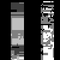
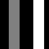

# Atomic operations with Atomix.jl

In case the different kernels access the same memory locations, [race conditions](https://en.wikipedia.org/wiki/Race_condition) can occur.
KernelAbstractions uses  [Atomix.jl](https://github.com/JuliaConcurrent/Atomix.jl) to provide access to atomic memory operations.

## Race conditions

The following example demonstrates a common race condition:

```julia
using CUDA, KernelAbstractions, Atomix
using ImageShow, ImageIO


function index_fun(arr; backend=get_backend(arr))
	out = similar(arr)
	fill!(out, 0)
	kernel! = my_kernel!(backend)
	kernel!(out, arr, ndrange=(size(arr, 1), size(arr, 2)))
	return out
end

@kernel function my_kernel!(out, arr)
	i, j = @index(Global, NTuple)
	for k in 1:size(out, 1)
		out[k, i] += arr[i, j]
	end
end

img = zeros(Float32, (50, 50));
img[10:20, 10:20] .= 1;
img[35:45, 35:45] .= 2;


out = Array(index_fun(CuArray(img)));
simshow(out)
```
In principle, this kernel should just smears the values of the pixels along the first dimension. 

However, the different `out[k, i]` are accessed from multiple work-items and thus memory races can occur.
We need to ensure that the accumulate `+=` occurs atomically.

The resulting image has artifacts.




## Fix with Atomix.jl
To fix this we need to mark the critical accesses with an `Atomix.@atomic`
```julia
function index_fun_fixed(arr; backend=get_backend(arr))
	out = similar(arr)
	fill!(out, 0)
	kernel! = my_kernel_fixed!(backend)
	kernel!(out, arr, ndrange=(size(arr, 1), size(arr, 2)))
	return out
end

@kernel function my_kernel_fixed!(out, arr)
	i, j = @index(Global, NTuple)
	for k in 1:size(out, 1)
		Atomix.@atomic out[k, i] += arr[i, j]
	end
end

out_fixed = Array(index_fun_fixed(CuArray(img)));
simshow(out_fixed)
```
This image is free of artifacts.



## Supported operations

`@atomic` is lowered to the atomic intrinsics of the backend in use, so which
operations and element types work depends on the backend. The following are
supported on every backend that reports `KernelAbstractions.supports_atomics(backend) == true`:

| Operation                                      | `Int32`, `UInt32`, `Int64`, `UInt64` | `Float32`, `Float64`[^1] |
|:-----------------------------------------------|:------------------------------------:|:------------------------:|
| `@atomic A[i] += x`, `@atomic A[i] -= x`       | ✓                                    | ✓                        |
| `@atomic A[i] &= x`, `@atomic A[i] \|= x`, `@atomic A[i] ⊻= x` | ✓                     |                          |
| `@atomic max(A[i], x)`, `@atomic min(A[i], x)` | ✓                                    | backend-dependent        |
| `@atomicreplace A[i] expected => desired`      | ✓                                    | ✓                        |

[^1]: `Float64` additionally requires `KernelAbstractions.supports_float64(backend) == true`.

Floating-point `max`/`min` are not portable. The CUDA backend has no native
floating-point min/max atomics and fails to compile kernels that use them, whereas
the CPU, POCL, AMDGPU, Metal and oneAPI backends support them. Portable code should
either restrict atomic min/max to integer element types, or implement it with
`@atomicreplace` in a compare-and-swap loop:

```julia
@kernel function atomic_fmax!(A, x)
    i = @index(Global, Linear)
    old = A[i]
    while true
        new = max(old, x)
        (; old, success) = @atomicreplace A[i] old => new
        success && break
    end
end
```
