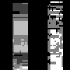

# Atomic operations with Atomix.jl

In case the different kernels access the same memory locations, [race conditions](https://en.wikipedia.org/wiki/Race_condition) can occur.
KernelAbstractions uses  [Atomix.jl](https://github.com/JuliaConcurrent/Atomix.jl) to provide access to atomic memory operations.

## Race conditions

The following example demonstrates a common race condition:

```julia
using CUDA, KernelAbstractions, Atomix
using ImageShow, ImageIO


function index_fun(arr; backend=get_backend(arr))
	out = similar(arr)
	fill!(out, 0)
	kernel! = my_kernel!(backend)
	kernel!(out, arr, ndrange=(size(arr, 1), size(arr, 2)))
	return out
end

@kernel function my_kernel!(out, arr)
	i, j = @index(Global, NTuple)
	for k in 1:size(out, 1)
		out[k, i] += arr[i, j]
	end
end

img = zeros(Float32, (50, 50));
img[10:20, 10:20] .= 1;
img[35:45, 35:45] .= 2;


out = Array(index_fun(CuArray(img)));
simshow(out)
```
In principle, this kernel just smears the values of the pixels along the first dimension. 
However, the different `out[k, i]` are accessed by each of the kernels multiple times, so racing conditions happen that some
kernels access old results or overwrite new results.

The resulting image has artifacts.




## Fix with Atomix.jl
To fix this we need to mark the critical accesses with an `Atomix.@atomic`
```julia
function index_fun_fixed(arr; backend=CUDABackend())
	out = similar(arr)
	fill!(out, 0)
	kernel! = my_kernel_fixed!(backend)
	kernel!(out, arr, ndrange=(size(arr, 1), size(arr, 2)))
	return out
end

@kernel function my_kernel_fixed!(out, arr)
	i, j = @index(Global, NTuple)
	for k in 1:size(out, 1)
		Atomix.@atomic out[k, i] += arr[i, j]
	end
end

out_fixed = Array(index_fun_fixed(CuArray(img)));
simshow(out_fixed)
```
This image is free of artifacts.


